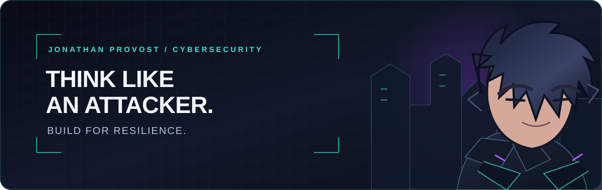

  

<h1 align="center">Jonathan Provost</h1>

  Senior Cybersecurity Analyst | Québec, Canada

## About me

I have spent about 20 years working in cybersecurity, across security operations, incident response, technical assessments, and security investigations. Some of that work has involved industrial espionage and highly motivated, well-resourced threat actors. Those experiences shaped how I approach the job: understand the evidence, test assumptions, and consider what a capable attacker could actually do.

Today, I help organizations assess and improve the security of the environments they depend on. That includes Microsoft 365 and Entra ID hardening, identity and access, Conditional Access, cross-tenant settings, vulnerability management, cloud security, and incident response. I care about how controls behave in practice, not only whether a setting appears enabled in a portal or a checklist.

I ask why a control is there, what risk it is meant to reduce, and whether it works in the organization’s real operating conditions. I look for the path an attacker could use, weigh the impact on people and operations, then explain what the evidence supports and what should be addressed first. Security recommendations should solve the client’s problem, fit the environment, and be realistic for the people who have to implement them.

I work with security platforms and tools including Microsoft 365, Entra ID, Microsoft Sentinel, SentinelOne, Cloudflare, and YARA. The right tool depends on the risk and the environment. I am more interested in whether the control is effective than in adding another product to the stack.

GitHub is where I keep my technical interests and security work. I am interested in practical defensive engineering, threat analysis, identity security, and the risks introduced by automation and AI.

## Platforms and tools

  
  
  
  
  
  

## Connect

